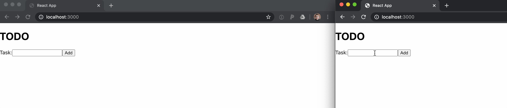

.. _examples:

Examples
--------

First install Yarn and Node v14. Using conda, enter:

::

   conda create -n rtc -c conda-forge jupyterlab nodejs=14 yarn
   conda activate rtc

Then you can start todo example app and the debugger:

::

   yarn
   yarn run build:tsc
   yarn run todo:start-all

